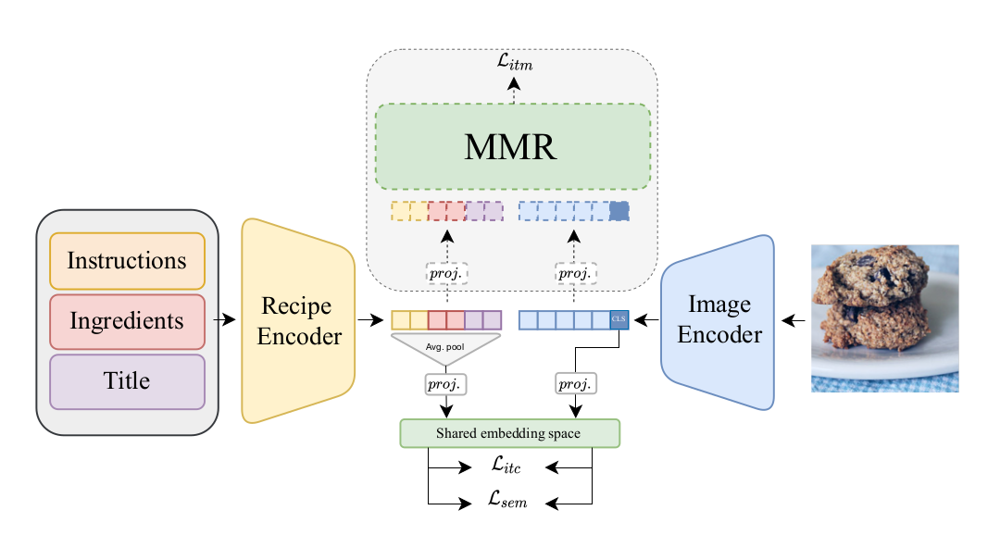

[](https://paperswithcode.com/sota/cross-modal-retrieval-on-recipe1m?p=transformer-decoders-with-multimodal)

# T-Food
Official implementation of the paper: 
- [Transformer Decoders with MultiModal Regularization for Cross-Modal Food
Retrieval (CVPR22 's MULA Workshop)](https://arxiv.org/abs/2204.09730)


### Summary:

* [Introduction](#introduction)
* [Installation](#installation)
* [Download and Prepare the Recipe1M dataset](#download-and-prepare-the-recipe1m-dataset)
* [Download Pretrained Models and Logs](#download-pretrained-models-and-logs)
* [Train the model](#train-the-model)
* [Evaluate a model on the test set](#evaluate-a-model-on-the-test-set)
* [Citation](#citation)
* [Acknowledgment](#acknowledgment)

## Introduction

<p align="center">
    
</p>

> Cross-modal image-recipe retrieval has gained significant attention in recent years. 
Most work focuses on improving cross-modal embeddings using unimodal encoders, that allow for efficient retrieval in large-scale databases, leaving aside cross-attention between modalities which is more computationally expensive. We propose a new retrieval framework, T-Food (Transformer Decoders with MultiModal Regularization for Cross-Modal Food Retrieval) that exploits the interaction between modalities in a novel regularization scheme, while using only unimodal encoders at test time for efficient retrieval. We also capture the intra-dependencies between recipe entities with a dedicated recipe encoder, and propose new variants of triplet losses with dynamic margins that adapt to the difficulty of the task. Finally, we leverage the power of the recent Vision and Language Pretraining (VLP) models such as CLIP for the image encoder. Our approach outperforms existing approaches by a large margin on the Recipe1M dataset. Specifically, we achieve absolute improvements of 8.1 % (72.6 R@1) and +10.9 % (44.6 R@1) on the 1k and 10k test sets respectively.


## Installation

Main requirements: Pytorch 1.7, clip, timm.

First create the conda environment from the `env.yaml` file:

```
conda env create --name tfood --file=env/env.yaml
source activate tfood
```

We use a [bootstrap.pytorch](https://github.com/Cadene/bootstrap.pytorch.git) as a high level framework, we made a slight modifications to the original repo, to install the correct one in developpement mode:
```
cd bootstrap.pytorch
pip install -e .
```

You need also to install clip from the original [repo](https://github.com/openai/CLIP):
```
pip install git+https://github.com/openai/CLIP.git
```

## Download Pretrained Models and Logs

You can downoload the pretrained weights and logs to test the model from [here](https://nuage.lip6.fr/s/YdziDxDD39B6mbB).
For testing our pretrained models, you can also download the tokenized layer1.

## Download and Prepare the Recipe1M dataset

Please, create an account on http://im2recipe.csail.mit.edu/ to download the dataset.

Create a directory (`root`) to download the dataset.

First download the `Layers` in `root` and tokenize layer1:
```
python preprocess/create_tokenized_layer.py --path_layer root/layer1.json --output_path_vocab root/vocab_all.txt --output_path_layer1 root/tokenized_layer_1.json --output_path_tokenized_texts root/text
```
Download `data.h5` in `root`, unzipp it and and create the lmdb files:

```
python preprocess/h5py_to_lmdb.py --dir_data root

```

Optional: Download the images and put them in `root/recipe1M/images`.

Download `classes1M.pkl`, and place the file in `root`.


## Train the model


The [boostrap/run.py](https://github.com/Cadene/bootstrap.pytorch/blob/master/bootstrap/run.py) file load the options contained in a yaml file, create the corresponding experiment directory (in exp/dir) and start the training procedure.

For instance, you can train our best model with 2 A100 (40 Gb) GPUs by running:
```
CUDA_VISIBLE_DEVICES=0,1 python -m bootstrap.run -o options/tfood_clip.yaml \
--misc.data_parrallel true 
```
To launch training of our model without clip you can use `tfood_clip.yaml` instead.

Then, several files are going to be created:
- options.yaml (copy of options)
- logs.txt (history of print)
- logs.json (batchs and epochs statistics)
- view.html (learning curves)
- ckpt_last_engine.pth.tar (checkpoints of last epoch)
- ckpt_last_model.pth.tar
- ckpt_last_optimizer.pth.tar
- ckpt_best_eval_epoch.metric.recall_at_1_im2recipe_mean_engine.pth.tar (checkpoints of best epoch)
- ckpt_best_eval_epoch.metric.recall_at_1_im2recipe_mean_model.pth.tar
- ckpt_best_eval_epoch.metric.recall_at_1_im2recipe_mean_optimizer.pth.tar


### Resume training

You can resume from the last epoch by specifying the options file from the experiment directory while overwritting the `exp.resume` option (default is None):
```
python -m bootstrap.run -o logs/path_to_saved_config_file_in_the_log_dir.yaml \
--exp.resume last
```

## Evaluate a model on the test set

You can evaluate your model on the testing set. In this example, [boostrap/run.py](https://github.com/Cadene/bootstrap.pytorch/blob/master/bootstrap/run.py) load the options from your experiment directory, resume the best checkpoint on the validation set and start an evaluation on the testing set instead of the validation set while skipping the training set (train_split is empty).
```
python -m bootstrap.run \
-o options/tfood_clip.yaml \
--exp.resume best_eval_epoch.metric.recall_at_1_im2recipe_mean \
--dataset.train_split \
--dataset.eval_split test \
--model.metric.nb_bags 10 \
--model.metric.nb_matchs_per_bag 1000 \
--model.metric.trijoint true \
--misc.data_parrallel false 
```

By default, the model is evaluated on the 1k setup, to evaluate on the 10k setup:

```
python -m bootstrap.run \
-o options/tfood_clip.yaml \
--exp.resume best_eval_epoch.metric.recall_at_1_im2recipe_mean \
--dataset.train_split \
--dataset.eval_split test \
--model.metric.nb_bags 5 \
--model.metric.nb_matchs_per_bag 10000 \
--model.metric.trijoint true \
--misc.data_parrallel false 
```
You can set `model.metric.trijoint` to false to obtain both metrics; from the dual encoders and the multimodal module.

## Citation

```
@inproceedings{shukor2022transformer,
  title={Transformer Decoders with MultiModal Regularization for Cross-Modal Food Retrieval},
  author={Shukor, Mustafa and Couairon, Guillaume and Grechka, Asya and Cord, Matthieu},
  booktitle={Proceedings of the IEEE/CVF Conference on Computer Vision and Pattern Recognition},
  pages={4567--4578},
  year={2022}
}
```


## Acknowledgment

The code is based on the original code of [Adamine](https://github.com/Cadene/recipe1m.bootstrap.pytorch). Some code was borrowed from [ALBEF](https://github.com/salesforce/ALBEF), [CLIP](https://github.com/openai/CLIP)and [timm](https://github.com/rwightman/pytorch-image-models).
